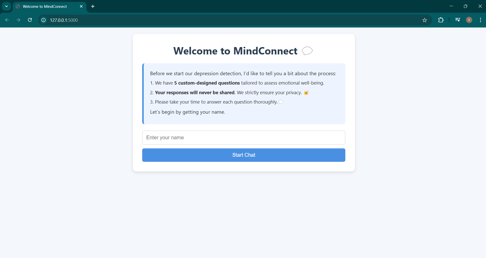
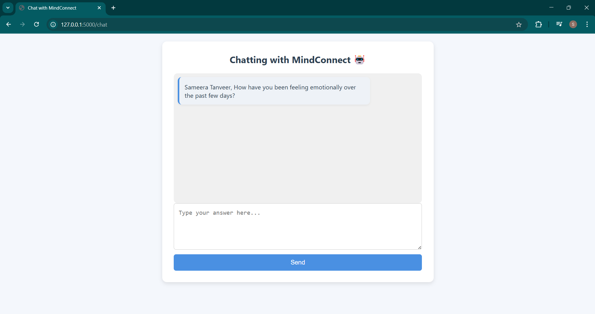
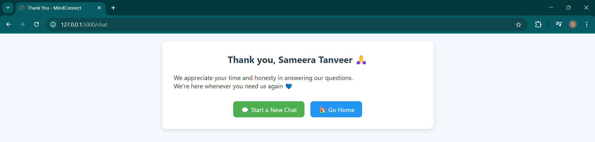

# Depression Detection Chatbot - Flask web App (Ongoing Project)
A conversational mental health assistant that detects signs of depression through empathetic, text-based interaction. Built with Flask, NLP, and pre-trained transformers for smart emotional analysis.

## Project Overview:
Mental health remains one of the most crucial yet under-discussed aspects of well-being. This chatbot project is designed to detect early signs of depression by asking thoughtful, pre-defined questions to the user via a simple web interface. Based on the user’s text responses, it eventually classifies whether the person is likely showing depressive symptoms using ML models trained on semantic embeddings.

This project aims to:

Offer a non-invasive, comfortable environment for users to reflect.

Identify emotional red flags using NLP and machine learning.

Be a lightweight, privacy-respecting assistant—not a diagnostic tool.

## Status:  Ongoing Development..
**Currently Completed:**

Flask-based frontend

Question-answer flow with session management

Modular project structure for scalability

## Quick view:
| Home Page            | Chat page                         | Thank you page
|------------------|-------------------------------------------| ---------------------- |
|     |                             |  

**In Progress:**

Dataset generation (synthetic & real)

Sentence embedding pipeline using BERT / Sentence Transformers

## Tech Stack:

| Area            | Tools / Libraries                         |
|------------------|-------------------------------------------|
| **Backend**     | Python, Flask                             |
| **Frontend**    | HTML, CSS, Jinja2 Templates               |
| **NLP**         | `sentence-transformers`, BERT (SBERT)     |
| **ML Models**   | Logistic Regression, SVM, XGBoost         |
| **Data Handling**| Pandas, CSV                              |
| **Deployment**  | Local testing via Flask server            |

## Flow of the Application

1. **User enters name** to initiate a session (stored via Flask session)
2. The chatbot presents **pre-defined mental health questions**
3. User responses are recorded sequentially
4. Once all responses are collected, data can be used for **ML-based classification**
5. **ML backend** (in development): Embeds responses using BERT and classifies using traditional ML algorithms

## Sample Questions

1. How have you been feeling emotionally over the past few days?
2. Do you feel motivated or energetic to do the things you normally enjoy?
3. Can you describe your sleep routine lately? Are you sleeping too much or too little?
4. Is there anything that’s been on your mind a lot lately or causing you stress?
5. What’s something that made you smile or feel good recently?
